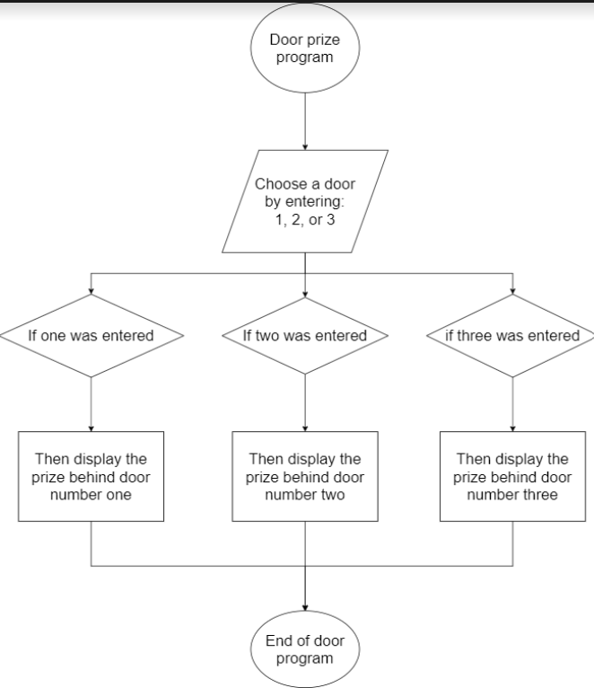

# Chapter-4-and-5
<h2>3.1. In the readme file - List three errors commonly made when writing selection structures.</h2>
<ol> <li>Using a compound condition rather than a nested selection structure</li>
<li>Reversing the directions in the outer and nested selection structure</li>
<li>Using an unnecessary nested selection structure</li>
</ol>

<h2>3.10. What kinds of things would be difficult to program without loops?<h2>

Things that are difficult to program without loops are any thing the needs to be repeated many times or if the computer needs to run though many solutions to find an answer.

<h2>3.11.What are the advantages and disadvantages of the switch statement versus a series of if statements?<h2>

Switch statements are easier to debug, read, and maintain. But they are harder to check ranges, and multiple condeition, and can not go as deep as if statements

<h2>3.12. When should you use a while loop over a do loop?<h2>

To save time or to repeat a funtion

<h2>3.13. Describe your favorite game in terms of the game loop. Is the game loop a good fit?<h2>

Checkers loop is players taking turns to move pieces until one wins

<h2>3.14. Why are infinite loops considered bad?<h2>

Infinite loops will cause a computer to crash because it cant handle all the data coming in

